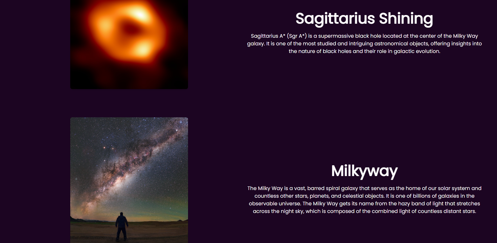
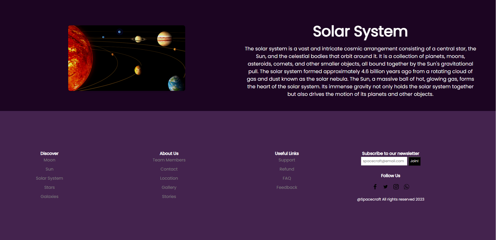

# animated-space-website
Animated Space-Themed Website

This project showcases a visually captivating and dynamically animated website built using CSS, HTML, and JavaScript. The website is centered around space exploration and features intriguing topics like the solar system, galaxies, and black holes.

FEATURES

-Dynamic Background Effect: Enjoy an immersive experience as visual elements elegantly respond to scrolling, creating a dynamic background effect.
Top Navigation Bar: Easily navigate through the website with the top navigation bar, offering links to key pages including "Home," "Works," "About," "Gallery," and "Contact."

-User Login Pop-up: Seamlessly log in with the user-friendly pop-up window and the "Sign In" button.

-In-Depth Sections: Dive into various captivating topics, each section enriched with high-quality images and informative text articles.

-Engaging Footer: Discover more with curated topics, stay connected through social media links, and consider subscribing for updates.

-Scroll-Activated Animations: Experience subtle animations for selected elements that dynamically come to life as you scroll or elevate the page, powered by JavaScript.

HOW TO USE

-Clone or Download: Begin by cloning this repository or downloading it as a ZIP file.

-Hosting: Upload the downloaded files to a web server for online access or simply open them in your web browser for local exploration.

-Navigate and Explore: Utilize the intuitive top navigation menu to seamlessly move between different pages and explore captivating content.

-User Login: For enhanced access, click the "Sign In" button to reveal the user login pop-up, then input the required credentials.

